<div align="center">

# 📊 Power BI Dashboards Collection

[](https://powerbi.microsoft.com/)
[](https://learn.microsoft.com/en-us/dax/)
[](LICENSE)
[](#️-dashboard-overview)

<br/>

> A collection of **6 professionally designed, fully interactive Power BI dashboards** spanning automotive sales, cryptocurrency markets, HR analytics, retail performance, luxury watch retail, and fitness tracking — each built with DAX measures, Power Query transformations, and polished UI design.

</div>

---

## 📑 Table of Contents

- [Dashboard Overview](#️-dashboard-overview)
- [Screenshots](#-screenshots)
- [Tools & Technologies](#️-tools--technologies)
- [Getting Started](#-getting-started)
- [Repository Structure](#-repository-structure)
- [Use Cases](#-use-cases)
- [Contributing](#-contributing)
- [License](#-license)
- [Author](#-author)

---

## 🗂️ Dashboard Overview

| # | Dashboard | Domain | Pages | Key Visuals |
|---|-----------|--------|-------|-------------|
| 1 | 🚗 Car Dashboard | Automotive Sales | 3 | KPI Cards, Bar/Column Charts, Donut |
| 2 | 💰 Crypto Currency | Finance & Markets | 2 | Line Charts, KPI Cards, Slicers |
| 3 | 👥 HR Analytics | Human Resources | 1 | Stacked Bar, Area Chart, Donut |
| 4 | 📈 Sales Analysis | Retail Sales | 2 | Map, Funnel, Pie, Line Chart |
| 5 | ⌚ Watch Dashboard | Luxury Retail | 1 | Area Chart, Column Chart, Donut |
| 6 | 🏃 Fitness Tracker | Health & Wellness | 1 | Bar, Line, Donut, Multi-Row Card |

---

### 1. 🚗 Car Dashboard
**File:** `Car Dashboard.pbix` &nbsp;|&nbsp; **Pages:** 3

An automotive sales performance dashboard tracking sales against budget targets with year-over-year growth analysis across vehicle categories, segments, and sale types.

| | |
|---|---|
| **Key Metrics** | Sale, Budget, Pre-Sale, Growth, Current Year Sales |
| **Dimensions** | Category, Sub-Category, Segment, Sale Type, Year |
| **Visuals** | KPI Cards, Clustered Bar & Column Charts, Donut Chart, Advanced Slicer, Action Buttons |

**✦ Highlights**
- Budget vs. actual sales comparison with growth % tracking
- Category and sub-category drill-down across 3 pages
- Segment-level performance breakdown (Replacement, Servicing, Other)
- Navigation action buttons for seamless page transitions
- Year filter (2019–2022) with slicer for Ship Mode & Region

---

### 2. 💰 Crypto Currency
**File:** `Crypto Currency.pbix` &nbsp;|&nbsp; **Pages:** 2

A cryptocurrency market intelligence dashboard with historical price trend analysis, market capitalization tracking, and multi-coin comparison across 2017–2021.

| | |
|---|---|
| **Key Metrics** | Market Cap, High Cap, Low Cap, Volume, Average Price |
| **Dimensions** | Coin Name, Date (Day / Month / Quarter / Year) |
| **Visuals** | KPI Cards, Line Charts, Advanced Slicer, Action Buttons, Text Boxes |

**✦ Highlights**
- **Page 1 — Market Overview:** Market cap, high/low cap, volume, average price trends
- **Page 2 — Price Analysis:** Open / Close / High / Low OHLC price movements
- Full date hierarchy filtering (day → month → quarter → year)
- Multi-coin comparison: Bitcoin, Cardano, Binance Coin, Chainlink & more

---

### 3. 👥 HR Analytics
**File:** `HR Analytics.pbix` &nbsp;|&nbsp; **Pages:** 1

A human resources analytics dashboard providing deep insight into employee attrition patterns, workforce demographics, salary benchmarks, and job satisfaction levels.

| | |
|---|---|
| **Key Metrics** | Attrition %, Total Employees, Avg Age, Avg Salary, Avg Tenure |
| **Dimensions** | Department, Job Role, Gender, Education Field, Age Group |
| **Visuals** | KPI Cards, Clustered Column Chart, Area Chart, Donut Chart, 100% Stacked Bar, Slicer |

**✦ Highlights**
- Overall attrition rate with total employee and active headcount KPIs
- Department and job role attrition breakdown
- Gender and education field distribution analysis
- Age group segmentation with job satisfaction scoring
- Average salary and years-at-company benchmarking

---

### 4. 📈 Sales Analysis
**File:** `Sales Analysis.pbix` &nbsp;|&nbsp; **Pages:** 2

A comprehensive retail sales dashboard covering geographic performance, customer segmentation, product-level profitability, and order trend analysis across US states.

| | |
|---|---|
| **Key Metrics** | Sales, Profit, Quantity, Discount |
| **Dimensions** | Region, State, Segment, Sub-Category, Order Date |
| **Visuals** | KPI Cards, Line Chart, Donut Chart, Pie Chart, Funnel Chart, Map, Bar Chart |

**✦ Highlights**
- **Page 1 — Overview:** Sales by region, sub-category funnel, US geographic map, trend line
- **Page 2 — Deep Dive:** Segment & regional breakdown with bar chart and map
- Four headline KPIs: Total Sales, Profit, Quantity Sold, Discount Applied
- US state-level geographic heat mapping
- Customer segment distribution (Consumer, Corporate, Home Office)

---

### 5. ⌚ Watch Dashboard
**File:** `Watch Dashboard.pbix` &nbsp;|&nbsp; **Pages:** 1

A luxury watch retail performance dashboard comparing 2022 vs. 2023 YTD sales with budget tracking, growth analytics, and country/region-level breakdowns.

| | |
|---|---|
| **Key Metrics** | Sales, Budget 2023, YTD Sales 2022 & 2023, Growth 22 vs 23 |
| **Dimensions** | Country, Region, Category, Segment, Customer Name, Month |
| **Visuals** | KPI Cards, Clustered Column Chart, Stacked Area Chart, Donut Chart, Slicer |

**✦ Highlights**
- YoY sales growth comparison (2022 vs. 2023) with growth % KPI
- Budget vs. actual performance variance tracking
- Country and region-level sales distribution
- Total growth breakdown by segment and category
- Monthly trend area chart with order date hierarchy

---

### 6. 🏃 Fitness Tracker App
**File:** `fitness_tracker_app_design.pbix` &nbsp;|&nbsp; **Pages:** 1

A mobile app-style fitness tracker designed entirely in Power BI, featuring personal health KPIs, goal-tracking range visuals, and a polished consumer app UI with custom SVG backgrounds.

| | |
|---|---|
| **Key Metrics** | Health Score, Avg Daily Steps, Avg Daily Calories, Avg Heart Rate, Exercise Sessions |
| **Dimensions** | User Name, Calendar (Weekday / Month / Quarter / Year) |
| **Visuals** | KPI Cards, Bar Chart, Line Chart, Donut Chart, Multi-Row Card, Slicer, Bookmark Navigator |

**✦ Highlights**
- Health Score gauge with fill-to-100 custom visualization
- Target min/max range tracking for all 4 health metrics
- Weekday and calendar-based period filtering
- Personalized welcome text dynamically rendered per user
- Custom SVG background for a native mobile app aesthetic

---

## 📸 Screenshots

### 🚗 Car Dashboard
| | |
|---|---|
| 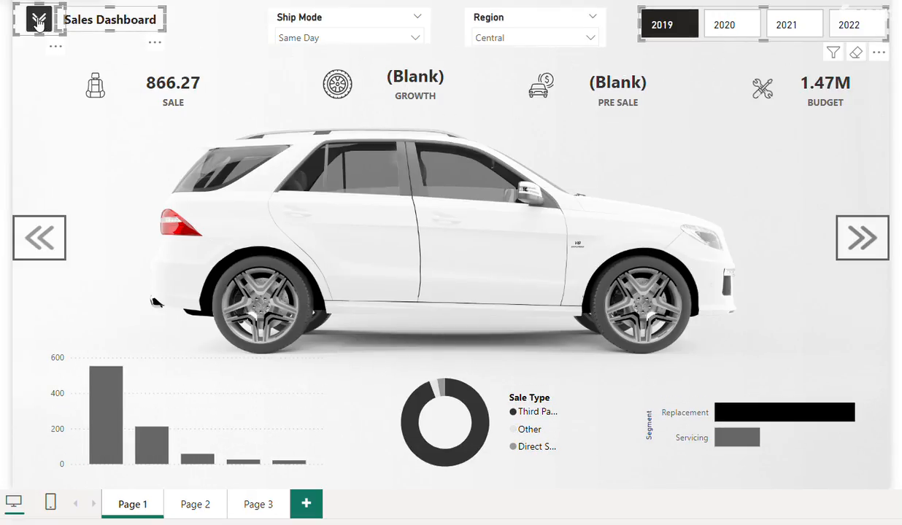 | 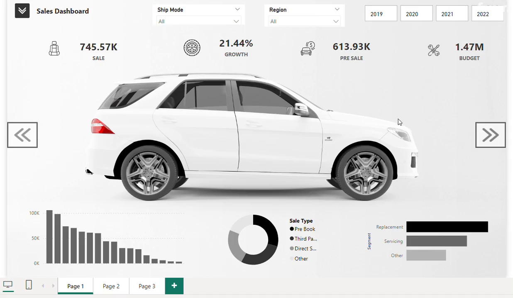 |

### 💰 Crypto Currency
| | |
|---|---|
| 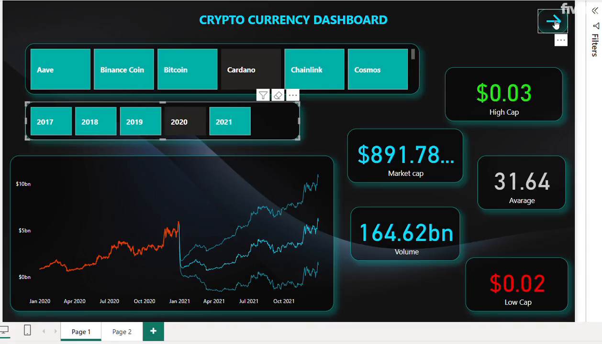 | 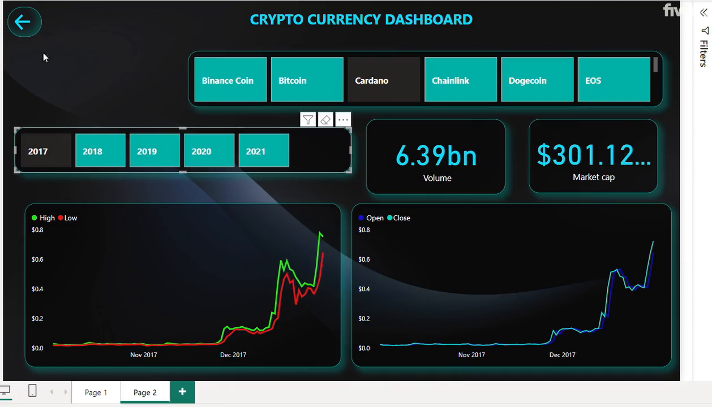 |

### 👥 HR Analytics
| | |
|---|---|
| 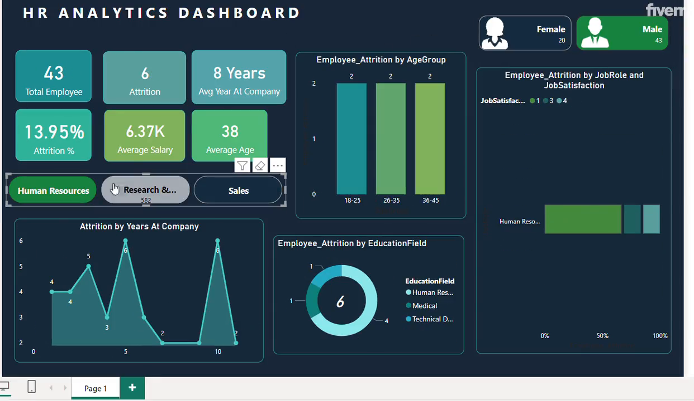 | 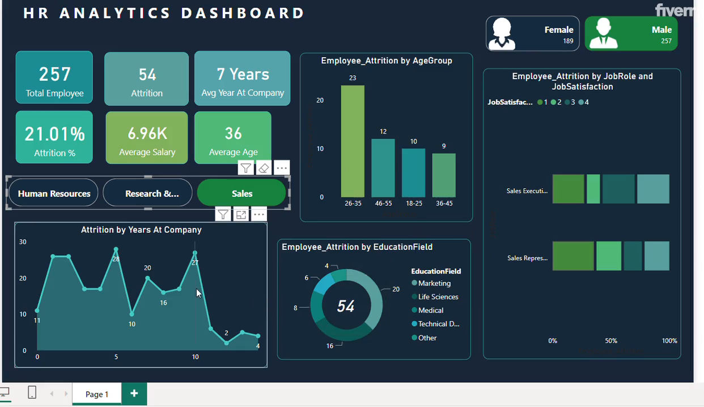 |

### 📈 Sales Analysis
| | |
|---|---|
| 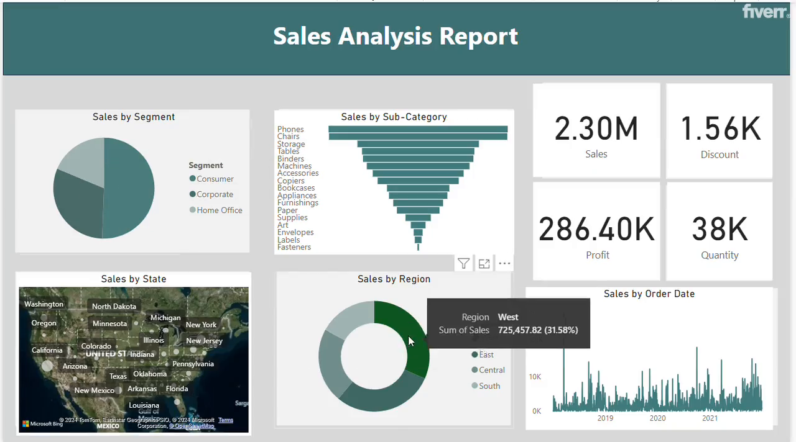 | 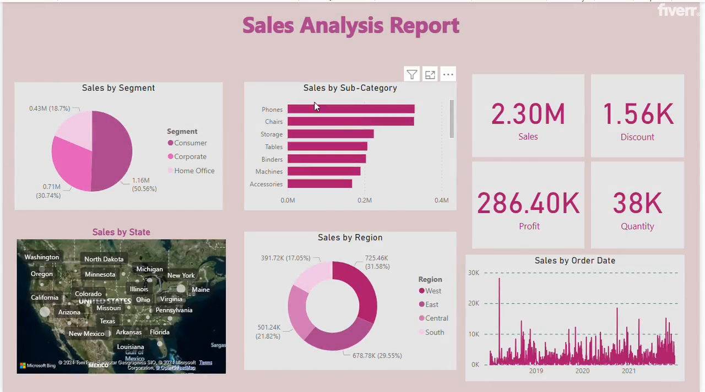 |

### ⌚ Watch Dashboard
| | |
|---|---|
| 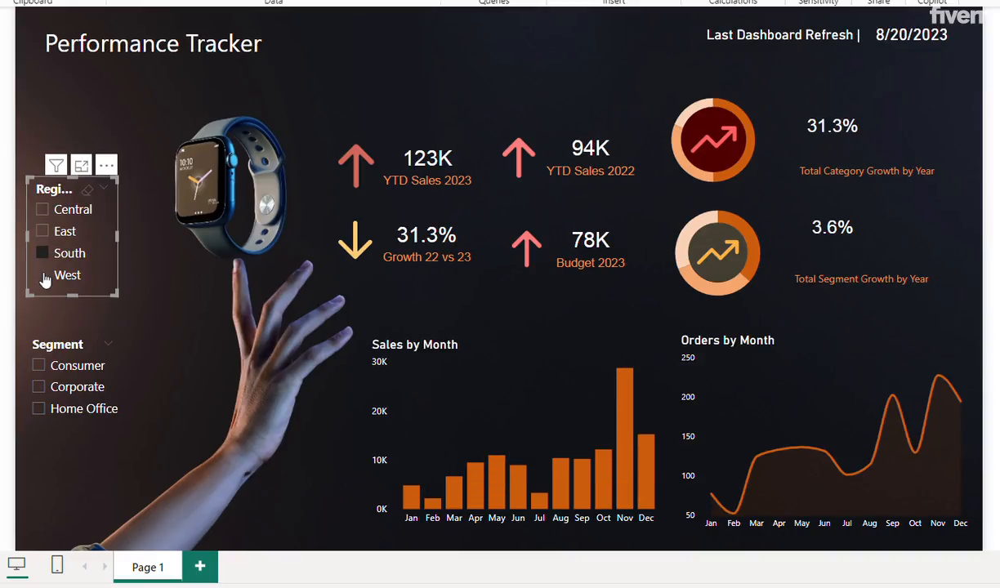 | 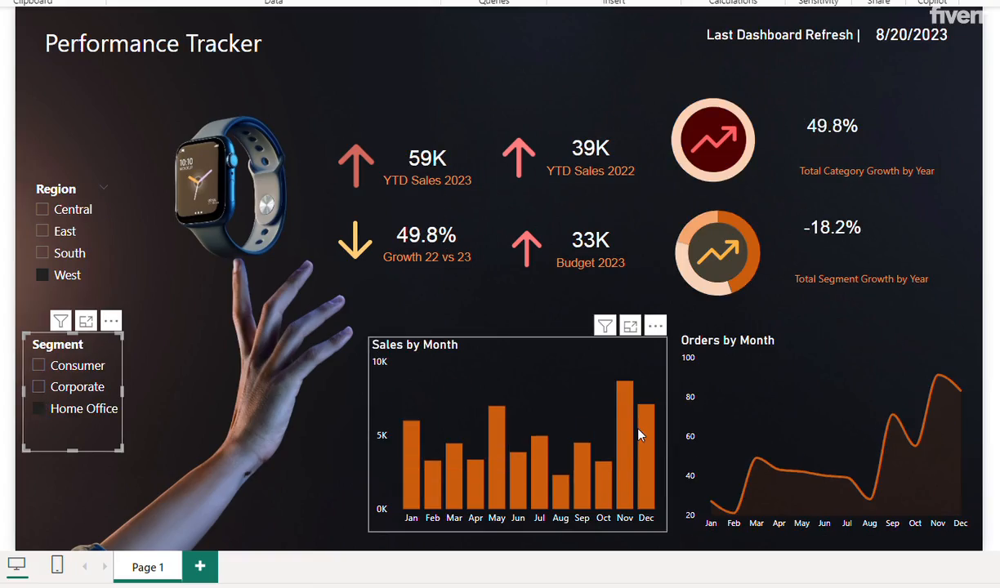 |

### 🏃 Fitness Tracker
| | |
|---|---|
| 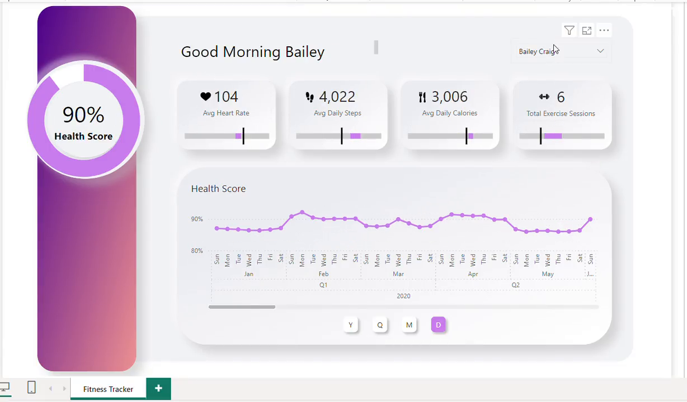 | 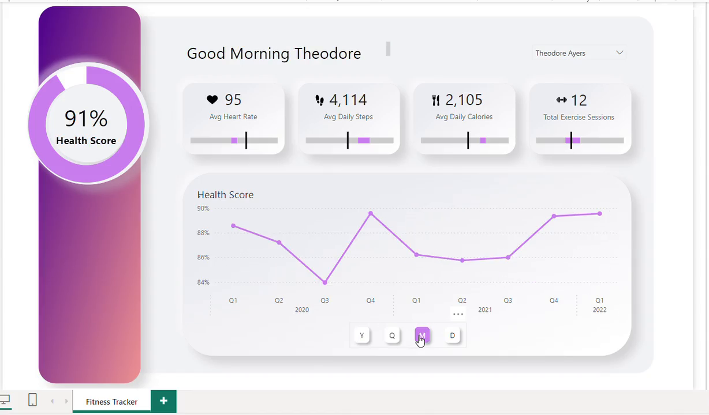 |

---

## 🛠️ Tools & Technologies

| Technology | Usage |
|---|---|
| **Microsoft Power BI Desktop** | Report authoring, data modeling, publishing |
| **DAX (Data Analysis Expressions)** | Calculated measures, KPIs, time intelligence |
| **Power Query (M Language)** | Data ingestion, transformation, ETL |
| **Custom Visuals** | `basicMap` (geo mapping), `simpleImage` (image rendering) |
| **Power BI Themes** | CY24SU02, CY23SU04, Highrise, AccessibleDefault |
| **SVG / Custom Backgrounds** | App-style UI design in Fitness Tracker |

---

## 🚀 Getting Started

### Prerequisites

- [Power BI Desktop](https://powerbi.microsoft.com/en-us/desktop/) — free download, **April 2024** or later recommended
- Windows 10/11 (Power BI Desktop is Windows-only)

### Installation

**1. Clone the repository**
```bash
git clone https://github.com/your-username/Power-Bi.git
cd Power-Bi
```

**2. Open any dashboard**
```
Launch Power BI Desktop
→ File → Open report
→ Browse to any .pbix file
→ Click Open
```

**3. Interact with the report**
- Use **slicers** to filter by date, region, category, or segment
- Click **action buttons** to navigate between pages
- Hover over visuals for **tooltips** with detailed breakdowns
- Use the **filter pane** for advanced cross-filtering

> 💡 **Note:** All dashboards use embedded sample data — no external database or API connection is required.

---

## 📁 Repository Structure

```
Power-Bi-main/
│
├── 📊 Car Dashboard.pbix               # Automotive sales performance (3 pages)
├── 📊 Crypto Currency.pbix             # Crypto market cap & price analysis (2 pages)
├── 📊 HR  Analytics.pbix               # Employee attrition & workforce insights (1 page)
├── 📊 Sales Analysis.pbix              # Regional & segment-wise sales (2 pages)
├── 📊 Watch Dashboard.pbix             # Luxury watch retail YoY growth (1 page)
├── 📊 fitness_tracker_app_design.pbix  # Fitness metrics app UI (1 page)
│
├── 🖼️ car-dashboard-1.png
├── 🖼️ car-dashboard-2.png
├── 🖼️ crypto-currency-1.png
├── 🖼️ crypto-currency-2.png
├── 🖼️ hr-analytics-1.png
├── 🖼️ hr-analytics-2.png
├── 🖼️ sales-analysis-1.png
├── 🖼️ sales-analysis-2.png
├── 🖼️ watch-dashboard-1.png
├── 🖼️ watch-dashboard-2.png
├── 🖼️ fitness-tracker-1.png
├── 🖼️ fitness-tracker-2.png
│
└── README.md
```

---

## 📌 Use Cases

| Dashboard | Who It's For |
|---|---|
| 🚗 Car Dashboard | Automotive dealerships, sales managers tracking vehicle segment performance |
| 💰 Crypto Currency | Traders and analysts monitoring crypto price trends and market cap history |
| 👥 HR Analytics | HR teams identifying attrition drivers and workforce composition insights |
| 📈 Sales Analysis | Retail businesses tracking regional revenue, profit margins, and order trends |
| ⌚ Watch Dashboard | Luxury retail brands measuring YoY sales growth across markets |
| 🏃 Fitness Tracker | Health app designers, UX prototypers, personal wellness enthusiasts |

---

## 🤝 Contributing

Contributions are welcome! To add a new dashboard or improve an existing one:

1. **Fork** the repository
2. **Create** a feature branch
   ```bash
   git checkout -b feature/new-dashboard-name
   ```
3. **Add** your `.pbix` file and screenshots
4. **Commit** with a descriptive message
   ```bash
   git commit -m "feat: Add Supply Chain Analytics dashboard"
   ```
5. **Push** to your branch and open a **Pull Request**

Please ensure your dashboard follows the existing naming conventions and includes at least 2 screenshots.

---

## 📄 License

This project is licensed under the **MIT License** — see the [LICENSE](LICENSE) file for details.

---

## 🙋 Author

**Your Name**
- GitHub: https://github.com/BrownSugar297
- LinkedIn: https://www.linkedin.com/in/ashikur-rahman-ashik-9798102b7/

---

<div align="center">

**⭐ If this repository helped you, please consider giving it a star — it helps others discover it!**

</div>

